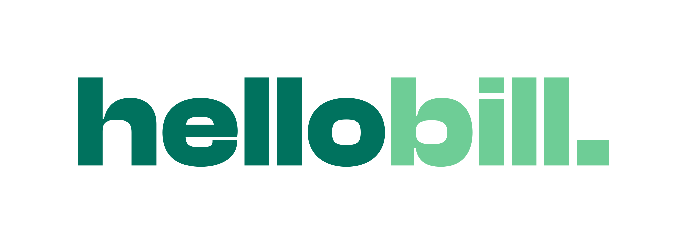
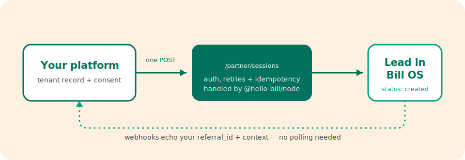

<div align="center">

<picture>
  <source media="(prefers-color-scheme: dark)" srcset="assets/hellobill-logo-inverse.svg">
  
</picture>

### One API call. A new home, sorted.

Create leads in **Bill OS** straight from your platform — no embed, no UI, no iframe.

[](https://www.npmjs.com/package/@hello-bill/node)


[hellobill.com](https://hellobill.com) · [SDK docs](https://hellobill.app/integrations/sdk) · [@hello-bill/node on npm](https://www.npmjs.com/package/@hello-bill/node)



</div>

## Why this exists

You already know the moment someone moves home. hellobill turns that moment into a home that's set up — energy, water, council tax, broadband — handled end to end.

This repo is the smallest possible integration: **one authenticated POST that creates a lead in Bill OS.** A "session" in the Partner API docs *is* a lead — `POST /partner/sessions` creates the record; the embed is just one optional way to act on it afterwards. Send us the tenant record. Done.

The scripts use [`@hello-bill/node`](https://www.npmjs.com/package/@hello-bill/node), the server-side SDK. OAuth2 client-credentials, token caching, single-flight refresh, retries with `Retry-After`, idempotency keys — all handled, so you never build that plumbing. The response's `session_token` / `embed_base_url` only matter if you mount the embed; for lead-sending they're ignored.

## Quick start

```bash
npm install
cp .env.example .env        # add your client id + secret (sandbox: sb_*)
node create-lead.mjs examples/lead-minimal.json --dry-run   # validate only
node create-lead.mjs examples/lead-minimal.json             # send it
node list-leads.mjs --email tenant@example.com              # verify it landed
```

Requires Node 20+.

## The payload (canonical snake_case `SessionPayload`)

| Field | Required | Notes |
|---|---|---|
| `customer.email` | **yes** | |
| `customer.title` | **yes** | `mr` `mrs` `miss` `ms` `mx` `dr` `other` |
| `customer.type` | **yes** | `tenant` for agency-sourced leads |
| `customer.first_name` | **yes** | enforced by live validation (schema marks it optional; `full_legal_name` does not substitute) |
| `addresses.current` (`address_line_1`, `city`, `postcode`) | **yes** | the property being moved into |
| `move.in.move_in_date` | **yes** | `YYYY-MM-DD` |
| `consent.data_sharing_accepted` (+ `_at`) | **yes** | must be `true` — only send opted-in leads |
| `customer.last_name` | no | optional (verified live); strongly recommended for sales |
| `customer.phone` | no | optional; practically essential for a sales call |
| `referral_id` | no | **partner-generated correlation id** (e.g. your tenant id). Echoed back on every webhook as `data.referral_id` — this is the bridge between your system and ours |
| `move.out` / `addresses.previous` | no | move-out date etc. — helpful, not required; agents ask on the call if missing |
| `occupants[]` | no | additional tenants for shared properties (send the primary tenant as `customer`) |
| `context[]` | no | free-form typed key-values `{name, type: string\|number\|boolean, value}` for anything else — tenancy stage, external refs. Echoed back on webhooks |
| `meters`, `journey_type` | no | optional extras; `journey_type` defaults to `move_in` |

See `examples/lead-minimal.json` (bare minimum) and `examples/lead-full.json` (shared tenancy with occupants, previous address, and tenancy-stage context). For real lead data, work in `payloads/` — it's gitignored so customer PII never lands in the repo.

## Notes for integrators

- **Sandbox vs live** is determined by the credential prefix (`sb_*` / `live_*`) with strict realm isolation.
- **Idempotency**: the SDK sends a UUID v4 idempotency key per POST automatically; pass your own for stable retries.
- **New tenancy → new lead.** Returning customers on a new tenancy should be sent as a fresh session with a fresh `referral_id` reference.
- **Base URL**: use `https://partnerapi.hellobill.app/api/v1`. The npm package's built-in default (`api.hellobill.app`) is stale and does not resolve — these scripts default to the correct host.
- **Raw API instead of the SDK**: it's two calls — OAuth2 client-credentials token, then `POST {base}/partner/sessions` with the same JSON. The SDK exists so you don't maintain that plumbing.

---

<div align="center">
<sub>Made by <a href="https://hellobill.com">hellobill</a> · your life admin, sorted · operated by The Bunch Group</sub>
</div>
